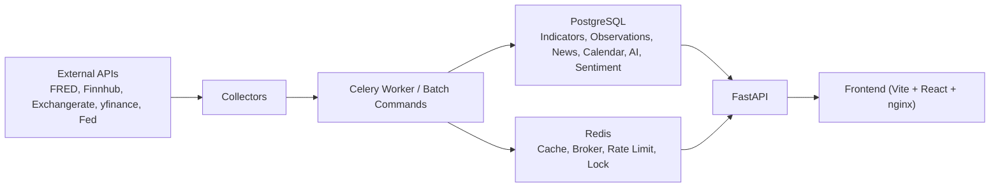

# MacroAnalysis

MacroAnalysis is a Docker-first macro data platform for collecting market and economic signals, normalizing them into a single time-series model, exposing them through FastAPI, and layering AI briefing plus sentiment/divergence analysis on top.

The current backend no longer uses legacy per-domain tables such as `interest_rates`, `macro_indicators`, or `exchange_rates`. The source of truth is now `indicators + observations + signals`, with calendar, news, AI, sentiment, and ops models separated by domain. Central-bank communications are stored in a generalized `communication_events` table rather than a FOMC-only event model. Economic calendar data is handled as a separate, static allowlisted domain backed by `backend/app/data/calendar_event_definitions.json`.

## What It Does

- Collects macro, rates, FX, equity, sector, FedWatch, FOMC, and news data from external sources.
- Normalizes time-series data into `Indicator` and `Observation`.
- Serves dashboard, history, calendar, news, AI, and sentiment APIs through FastAPI.
- Runs scheduled collection and post-processing jobs with Celery worker/beat.
- Stores application data in PostgreSQL and uses Redis for cache, broker, backend, and rate-limit state.
- Generates typed AI summaries (`macro`, `market`, `calendar`, `communication`) and sentiment/divergence signals when the required keys are configured.

## Architecture



### Data Flow

1. Collectors fetch raw data from external providers.
2. Batch commands or Celery jobs normalize records into domain models.
3. PostgreSQL stores durable state; Redis accelerates cache, locking, and queueing.
4. FastAPI reads normalized data and returns API DTOs.
5. Frontend consumes `/api/*` for dashboard, news, FOMC, and AI interactions.

## Repository Layout

```text
MacroAnalysis/
├── docker-compose.yml
├── Makefile
├── README.md
├── backend/
│   ├── Dockerfile
│   ├── alembic.ini
│   ├── alembic/
│   │   ├── env.py
│   │   └── versions/
│   ├── app/
│   │   ├── api/
│   │   │   ├── dependencies.py
│   │   │   ├── indicator_schemas.py
│   │   │   ├── calendar_schemas.py
│   │   │   ├── ai_schemas.py
│   │   │   ├── sentiment_schemas.py
│   │   │   └── routes/
│   │   ├── collectors/
│   │   ├── commands/
│   │   ├── core/
│   │   ├── data/
│   │   ├── models/
│   │   │   ├── timeseries.py
│   │   │   ├── calendar.py
│   │   │   ├── news.py
│   │   │   ├── ai.py
│   │   │   ├── sentiment.py
│   │   │   └── ops.py
│   │   ├── scripts/
│   │   ├── services/
│   │   ├── workers/
│   │   └── main.py
│   ├── requirements.txt
├── frontend/
│   ├── Dockerfile
│   ├── nginx.conf
│   ├── package.json
│   └── src/
│       ├── App.tsx
│       ├── main.tsx
│       ├── pages/
│       └── shared/
```

### Backend Domain Boundaries

- `backend/app/models/timeseries.py`: `Indicator`, `Observation`, `Signal`, `ChangeSnapshot`
- `backend/app/models/calendar.py`: `CommunicationEvent`, FOMC detail, and economic calendar models
- `backend/app/models/news.py`: `NewsItem` and URL-hash deduplication
- `backend/app/models/ai.py`: typed `AiSummary`, legacy `DailyInsight`, and explanation models
- `backend/app/models/sentiment.py`: sentiment, expectation, divergence models
- `backend/app/models/ops.py`: cleanup and collection run models
- `backend/app/data/calendar_event_definitions.json`: allowlisted calendar metadata, descriptions, and static timing

### API Route Split

- `summary.py`: `/api/summary`, `/api/changes`, `/api/sectors`
- `indicators.py`: chart/history/explanation APIs
- `calendar.py`: calendar and FOMC APIs
- `news.py`: news listing API
- `ai.py`: typed AI summary and AI chat APIs
- `sentiment.py`: expectations, divergence, sentiment signal APIs

## Localization

- The frontend now supports `한국어 / English` switching with a persisted locale key: `macroanalysis.locale`.
- Static metadata remains JSON-seed owned. Indicator explanations and calendar definitions now carry `translations.ko` / `translations.en` blocks while preserving the existing top-level Korean content for seed compatibility.
- Static-text APIs accept `lang=ko|en` and currently apply locale overlay to:
  - `/api/indicator-explanations`
  - `/api/indicator-explanations/{indicator_key}`
  - `/api/calendar/month`
  - `/api/calendar/events`
  - `/api/calendar/events/{event_id}`
  - `/api/fomc`
  - `/api/summary`
  - `/api/changes`
- Fallback order is: requested locale -> opposite locale -> existing DB/static value -> key/code.
- Dynamic content such as news headlines, AI summary body text, daily insight prose, and communication full text is intentionally left untranslated in this phase.

## Database Model and Migration Policy

### Source of Truth

- Time-series data is stored in `indicators` and `observations`.
- `observations` keeps one latest value per `indicator_id + date`.
- Vintage or revision history is not stored yet.
- If vintage support becomes necessary, add a dedicated migration with `vintage_date` or `revision_tag` rather than weakening the current unique key.
- Central-bank communication records are stored in `communication_events`.
- FOMC-specific meeting outcome details remain in `fomc_event_details`, linked from `economic_calendar_events`.

### Migration Policy

- Schema changes must go through Alembic.
- FastAPI startup no longer calls `Base.metadata.create_all()` in normal operation.
- Startup now validates that the database is already at Alembic `head`.
- Docker startup runs:
  1. `python -m app.core.migration_bootstrap`
  2. `alembic upgrade head`
  3. `uvicorn app.main:app ...`

### Legacy Bootstrap Note

Older environments that were created during the `create_all()` era may have real tables but no `alembic_version` row. `backend/app/core/migration_bootstrap.py` detects that case and stamps the DB to the correct baseline before applying newer migrations.

### Migration Safety

- Back up PostgreSQL before applying schema changes in shared environments.
- The communication generalization migration moves existing `fomc_events` rows into `communication_events`.
- The AI summary migration expands `ai_summaries` with `summary_type` and `target_key`.
- `news_items` and `change_snapshots` are created by Alembic so `make collect` can run cleanly on a fresh database.

## Economic Calendar

Calendar is a standalone domain for core macro events, not a generic market-event scraper. It keeps a fixed allowlist, stores human-readable metadata alongside each event, and uses FRED release dates plus static timing to avoid extra vendor dependencies.

The frontend now uses two calendar views on top of the same domain data:

- Dashboard `Calendar Watch`: a compact monthly grid with today highlighting and selected-day agenda.
- Calendar page: a larger monthly grid with day agenda, FOMC watch, and FOMC detail side panels.

To support that, the backend exposes both:

- `/api/calendar/events` for detailed event payloads and selected-day agenda queries
- `/api/calendar/month` for fixed 7x6 monthly grid summaries grouped by `event_date_local`

### Calendar Sources

- `FRED releases/dates` for most release dates.
- Static time map for event time, timezone, precision, and confidence.
- Federal Reserve FOMC calendar for meeting dates and minutes.
- Rule generation for monthly OPEX and triple witching.
- Optional BEA schedule only as a fallback for GDP and PCE timing.
- BLS calendar download, ICS fetch, and schedule scraping are not used.

### Tracked Events

- Inflation: `US_CPI`, `US_PPI`, `US_PCE`
- Labor: `US_EMPLOYMENT_SITUATION`, `US_JOBLESS_CLAIMS`, `US_JOLTS`
- Growth / Consumption: `US_GDP`, `US_RETAIL_SALES`, `US_DURABLE_GOODS`
- Housing: `US_HOUSING_STARTS`, `US_NEW_HOME_SALES`
- Business Cycle: `US_ISM_MANUFACTURING`, `US_ISM_SERVICES`
- Fed: `FOMC_MEETING`, `FOMC_MINUTES`
- Market Calendar: `US_MONTHLY_OPEX`, `US_TRIPLE_WITCHING`
- Sentiment: `US_CONSUMER_SENTIMENT`

Each event definition includes display text, beginner-friendly description, why-it-matters guidance, related indicator keys, watch items, event type, category, importance, and static timing metadata.

### FOMC Data Split

- `economic_calendar_events` stores the meeting date itself.
- `fomc_event_details` stores the outcome and document URLs such as statement, minutes, SEP, and press conference links.
- `communication_events` continues to hold broader Fed communication items.

## Running the Stack

### 1. Prepare `.env`

Create a root-level `.env`.

```dotenv
POSTGRES_PASSWORD=macropass
APP_ENV=production
FRONTEND_PORT=8080

FRED_API_KEY=
FINNHUB_API_KEY=
EXCHANGERATE_API_KEY=
OPENAI_API_KEY=

AI_MODEL=gpt-4o-mini
API_ACCESS_KEY=
CORS_ORIGINS=http://localhost:5173,http://127.0.0.1:5173,http://localhost:8080,http://127.0.0.1:8080,http://localhost:80,http://127.0.0.1:80
AI_ROUTE_RATE_LIMIT_WINDOW_SECONDS=60
AI_ROUTE_RATE_LIMIT_MAX_REQUESTS=20

DEV_DATABASE_AUTO_INIT=false
COLLECTION_LOCK_BACKEND=postgres
COLLECTION_GUARD_ENABLED=true

AI_DAILY_INSIGHT_ENABLED=true
AI_DAILY_INSIGHT_TIMEZONE=Asia/Seoul
AI_DAILY_INSIGHT_TRIGGER_IN_MORNING_BATCH=true
AI_DAILY_INSIGHT_BACKFILL_TRIGGER_ENABLED=true

SENTIMENT_PIPELINE_ENABLED=true
SENTIMENT_REPORTS_ENABLED=false
FOMC_SENTIMENT_ENABLED=true
```

### 2. Start Docker

Colima example:

```bash
colima start --cpu 4 --memory 8 --disk 60
docker context use colima
```

### 3. Start the application

```bash
docker compose up -d --build
docker compose ps
```

Endpoints:

- Frontend: `http://localhost:8080`
- API docs: `http://localhost:8000/api/docs`
- Health check: `http://localhost:8000/health`

### 4. Manual migration commands

Normal startup already runs Alembic, but manual commands are still available:

```bash
make migrate
docker compose exec backend alembic current
docker compose exec backend alembic upgrade head
```

### 5. Development-only auto-init

For isolated development experiments, you can opt into SQLAlchemy table creation:

```dotenv
DEV_DATABASE_AUTO_INIT=true
```

Use this only for disposable local environments. Alembic remains the standard path for shared or long-lived DBs.

### 6. Optional metadata seed

Indicator explanation metadata can be re-seeded manually:

```bash
docker compose exec backend python -m app.scripts.seed_indicator_explanations
```

## Common Commands

```bash
make doctor
make up
make down
make logs
make migrate
make collect
make collect-calendar
make collect-weekly
make collect-sentiment
make ensure-ai-insight
make db-stats
make db-size
make db-cleanup
make db-deduplicate-check
```

### Batch Collection Commands

- `make collect`: runs `morning -> noon -> evening`, with the news and snapshot jobs isolated so missing derived tables do not stop the rest of the batch
- `make collect-calendar`: runs the allowlisted economic calendar batch based on FRED, static timing, Fed calendar, and rule generation
- `make collect-weekly`: runs the calendar batch plus FOMC and Fed communication collection
- `make collect-sentiment`: runs the sentiment pipeline synchronously
- `make ensure-ai-insight`: forces or ensures daily AI insight generation

## Security and Operational Behavior

### CORS

- Wildcard CORS is removed.
- Allowed origins come from `CORS_ORIGINS`.
- Include only the frontend origins you actually need.

### AI Route Protection

- `/api/ai/chat` supports `X-API-Key` validation through `API_ACCESS_KEY`.
- If `API_ACCESS_KEY` is empty, the route is open but still rate-limited.
- The frontend can forward this via `VITE_API_ACCESS_KEY` when needed.
- `/api/ai/summary` supports `summary_type`, `target_key`, and `days` query parameters.

Example:

```bash
curl -X POST http://localhost:8000/api/ai/chat \
  -H 'Content-Type: application/json' \
  -H 'X-API-Key: your-key' \
  -d '{"message":"What changed in rates today?"}'
```

### Rate Limiting

- `/api/ai/chat` uses Redis-backed request counting.
- If Redis is unavailable, the app falls back to in-process counters instead of failing the whole request path.

### Cache and Lock Fallback

- API cache uses Redis when available.
- On Redis failure, cache reads/writes degrade to local in-memory fallback.
- Redis lock backends for collection and daily insight also fall back to local locking when Redis is down.

### Retention and Cleanup

Cleanup targets logs and derived records, not core observation history.

Important retention settings:

- `COLLECTION_SUCCESS_LOG_RETENTION_DAYS`
- `COLLECTION_FAILURE_LOG_RETENTION_DAYS`
- `RAW_RESPONSE_RETENTION_DAYS`
- `DEBUG_LOG_RETENTION_DAYS`
- `SCHEDULER_LOG_RETENTION_DAYS`

Run cleanup manually:

```bash
make db-cleanup
```

## Example APIs

### Dashboard Summary

```bash
curl http://localhost:8000/api/summary
```

Response shape:

```json
{
  "updated_at": "2026-06-10T21:00:00",
  "alerts": [],
  "snapshots": {},
  "equities": {},
  "yield_curve": {},
  "fomc": {
    "next_date": null,
    "days_left": null,
    "prob_hold": null,
    "prob_cut": null,
    "prob_hike": null,
    "prob_method": null
  },
  "ai_headline": null,
  "ai_as_of_date": null,
  "news_preview": []
}
```

### Indicator History

```bash
curl "http://localhost:8000/api/indicators/history/DGS10?period=3m"
```

### Calendar

```bash
curl "http://localhost:8000/api/calendar/month?month=2026-06&today_basis=market"
curl "http://localhost:8000/api/calendar/events?days=30&include_details=true"
curl "http://localhost:8000/api/calendar/events?from=2026-06-23&to=2026-06-23&include_details=true"
curl http://localhost:8000/api/fomc
```

Example response fields:

```json
{
  "id": 1,
  "event_key": "US_CPI",
  "display_name": "미국 CPI",
  "short_name": "CPI",
  "event_type": "macro_release",
  "category": "inflation",
  "importance": "high",
  "event_datetime_utc": "2026-06-10T12:30:00Z",
  "event_date_local": "2026-06-10",
  "event_time_local": "08:30",
  "timezone": "America/New_York",
  "display_time": "08:30 ET",
  "status": "scheduled",
  "source": "fred",
  "date_precision": "datetime_estimated",
  "time_source": "static_time_map",
  "time_confidence": "static_high",
  "beginner_description": "소비자가 실제로 구매하는 상품과 서비스 가격의 변화를 보여주는 대표 물가 지표입니다.",
  "why_it_matters": "물가 압력이 높으면 금리 인하 기대가 약해지고 주식시장에는 부담이 될 수 있습니다.",
  "watch_items": ["2Y Treasury Yield", "DXY", "S&P 500", "FedWatch"],
  "related_indicator_keys": ["CPIAUCSL", "CPILFESL"]
}
```

### Typed AI Summary

```bash
curl "http://localhost:8000/api/ai/summary?summary_type=macro&days=7"
curl "http://localhost:8000/api/ai/summary?summary_type=communication&target_key=Powell&days=30"
```

Response shape:

```json
{
  "id": 1,
  "summary_date": "2026-06-11T10:00:00",
  "summary_type": "communication",
  "target_key": "Powell",
  "headline": "Communication summary (Powell)",
  "body": "Recent Federal Reserve communication context...",
  "model_used": "gpt-4o-mini",
  "metadata": {
    "event_count": 1
  }
}
```

### Sentiment and Divergence

```bash
curl "http://localhost:8000/api/expectations?days=30"
curl "http://localhost:8000/api/divergence?days=7"
curl "http://localhost:8000/api/sentiment/signals?limit=50"
```

Communication events can also feed this pipeline directly. The normalized source type stored in `sentiment_signals.source_type` is `communication_event`.

## Contribution Notes

- Keep model definitions in the correct domain file under `backend/app/models/`.
- Keep route handlers in `backend/app/api/routes/` and schemas in dedicated schema modules.
- Any schema change requires:
  1. model update
  2. Alembic revision
  3. README update if the operation surface changed
- Do not reintroduce legacy per-domain time-series tables.
- Prefer using `indicator_registry` and observation upserts for new time-series collectors.
- Prefer `CommunicationEvent` over FOMC-specific ad hoc models for new central-bank content.
- When adding AI summaries, scope them with `summary_type` and `target_key` instead of creating one-off tables.

## Known Follow-Up Work

- Add first-class vintage/revision support if historical revisions become product-critical.
- Expand FOMC sentiment beyond statement text into speeches and other unstructured Fed communication.
- Extend frontend to consume more of the expectation/divergence APIs directly.
