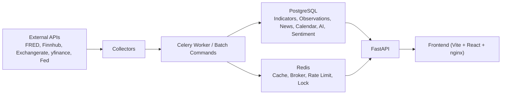

# MacroAnalysis

MacroAnalysis is a Docker-first macro data platform for collecting market and economic signals, normalizing them into a single time-series model, exposing them through FastAPI, and layering AI briefing plus sentiment/divergence analysis on top.

The current backend no longer uses legacy per-domain tables such as `interest_rates`, `macro_indicators`, or `exchange_rates`. The source of truth is now `indicators + observations + signals`, with calendar, news, AI, sentiment, and ops models separated by domain.

## What It Does

- Collects macro, rates, FX, equity, sector, FedWatch, FOMC, and news data from external sources.
- Normalizes time-series data into `Indicator` and `Observation`.
- Serves dashboard, history, calendar, news, AI, and sentiment APIs through FastAPI.
- Runs scheduled collection and post-processing jobs with Celery worker/beat.
- Stores application data in PostgreSQL and uses Redis for cache, broker, backend, and rate-limit state.
- Generates daily AI insight summaries and sentiment/divergence signals when the required keys are configured.

## Architecture



### Data Flow

1. Collectors fetch raw data from external providers.
2. Batch commands or Celery jobs normalize records into domain models.
3. PostgreSQL stores durable state; Redis accelerates cache, locking, and queueing.
4. FastAPI reads normalized data and returns API DTOs.
5. Frontend consumes `/api/*` for dashboard, news, FOMC, and AI interactions.

## Repository Layout

```text
MacroAnalysis/
├── docker-compose.yml
├── Makefile
├── README.md
├── backend/
│   ├── Dockerfile
│   ├── alembic.ini
│   ├── alembic/
│   │   ├── env.py
│   │   └── versions/
│   ├── app/
│   │   ├── api/
│   │   │   ├── dependencies.py
│   │   │   ├── route_helpers.py
│   │   │   ├── indicator_schemas.py
│   │   │   ├── calendar_schemas.py
│   │   │   ├── ai_schemas.py
│   │   │   ├── sentiment_schemas.py
│   │   │   └── routes/
│   │   ├── collectors/
│   │   ├── commands/
│   │   ├── core/
│   │   ├── data/
│   │   ├── models/
│   │   │   ├── timeseries.py
│   │   │   ├── calendar.py
│   │   │   ├── news.py
│   │   │   ├── ai.py
│   │   │   ├── sentiment.py
│   │   │   └── ops.py
│   │   ├── scripts/
│   │   ├── services/
│   │   ├── workers/
│   │   └── main.py
│   ├── requirements.txt
│   └── tests/
├── frontend/
│   ├── Dockerfile
│   ├── nginx.conf
│   ├── package.json
│   └── src/
```

### Backend Domain Boundaries

- `backend/app/models/timeseries.py`: `Indicator`, `Observation`, `Signal`, `ChangeSnapshot`
- `backend/app/models/calendar.py`: FOMC and economic calendar models
- `backend/app/models/news.py`: `NewsItem` and URL-hash deduplication
- `backend/app/models/ai.py`: AI summary and explanation models
- `backend/app/models/sentiment.py`: sentiment, expectation, divergence models
- `backend/app/models/ops.py`: cleanup and collection run models

### API Route Split

- `summary.py`: `/api/summary`, `/api/changes`, `/api/sectors`
- `indicators.py`: chart/history/explanation APIs
- `calendar.py`: calendar and FOMC APIs
- `news.py`: news listing API
- `ai.py`: AI summary and AI chat APIs
- `sentiment.py`: expectations, divergence, sentiment signal APIs

## Database Model and Migration Policy

### Source of Truth

- Time-series data is stored in `indicators` and `observations`.
- `observations` keeps one latest value per `indicator_id + date`.
- Vintage or revision history is not stored yet.
- If vintage support becomes necessary, add a dedicated migration with `vintage_date` or `revision_tag` rather than weakening the current unique key.

### Migration Policy

- Schema changes must go through Alembic.
- FastAPI startup no longer calls `Base.metadata.create_all()` in normal operation.
- Startup now validates that the database is already at Alembic `head`.
- Docker startup runs:
  1. `python -m app.core.migration_bootstrap`
  2. `alembic upgrade head`
  3. `uvicorn app.main:app ...`

### Legacy Bootstrap Note

Older environments that were created during the `create_all()` era may have real tables but no `alembic_version` row. `backend/app/core/migration_bootstrap.py` detects that case and stamps the DB to the correct baseline before applying newer migrations.

## Running the Stack

### 1. Prepare `.env`

Create a root-level `.env`.

```dotenv
POSTGRES_PASSWORD=macropass
APP_ENV=production
FRONTEND_PORT=8080

FRED_API_KEY=
FINNHUB_API_KEY=
EXCHANGERATE_API_KEY=
OPENAI_API_KEY=

AI_MODEL=gpt-4o-mini
API_ACCESS_KEY=
CORS_ORIGINS=http://localhost:5173,http://127.0.0.1:5173,http://localhost:8080,http://127.0.0.1:8080,http://localhost:80,http://127.0.0.1:80
AI_ROUTE_RATE_LIMIT_WINDOW_SECONDS=60
AI_ROUTE_RATE_LIMIT_MAX_REQUESTS=20

DEV_DATABASE_AUTO_INIT=false
COLLECTION_LOCK_BACKEND=postgres
COLLECTION_GUARD_ENABLED=true

AI_DAILY_INSIGHT_ENABLED=true
AI_DAILY_INSIGHT_TIMEZONE=Asia/Seoul
AI_DAILY_INSIGHT_TRIGGER_IN_MORNING_BATCH=true
AI_DAILY_INSIGHT_BACKFILL_TRIGGER_ENABLED=true

SENTIMENT_PIPELINE_ENABLED=true
SENTIMENT_REPORTS_ENABLED=false
FOMC_SENTIMENT_ENABLED=true
```

### 2. Start Docker

Colima example:

```bash
colima start --cpu 4 --memory 8 --disk 60
docker context use colima
```

### 3. Start the application

```bash
docker compose up -d --build
docker compose ps
```

Endpoints:

- Frontend: `http://localhost:8080`
- API docs: `http://localhost:8000/api/docs`
- Health check: `http://localhost:8000/health`

### 4. Manual migration commands

Normal startup already runs Alembic, but manual commands are still available:

```bash
make migrate
docker compose exec backend alembic current
docker compose exec backend alembic upgrade head
```

### 5. Development-only auto-init

For isolated development experiments, you can opt into SQLAlchemy table creation:

```dotenv
DEV_DATABASE_AUTO_INIT=true
```

Use this only for disposable local environments. Alembic remains the standard path for shared or long-lived DBs.

### 6. Optional metadata seed

Indicator explanation metadata can be re-seeded manually:

```bash
docker compose exec backend python -m app.scripts.seed_indicator_explanations
```

## Common Commands

```bash
make doctor
make up
make down
make logs
make migrate
make collect
make collect-calendar
make collect-weekly
make collect-sentiment
make ensure-ai-insight
make db-stats
make db-size
make db-cleanup
make db-deduplicate-check
make test
make test-container
```

### Batch Collection Commands

- `make collect`: runs `morning -> noon -> evening`
- `make collect-calendar`: runs calendar collection batch
- `make collect-weekly`: runs weekly calendar/FOMC maintenance batch
- `make collect-sentiment`: runs the sentiment pipeline synchronously
- `make ensure-ai-insight`: forces or ensures daily AI insight generation

## Security and Operational Behavior

### CORS

- Wildcard CORS is removed.
- Allowed origins come from `CORS_ORIGINS`.
- Include only the frontend origins you actually need.

### AI Route Protection

- `/api/ai/chat` supports `X-API-Key` validation through `API_ACCESS_KEY`.
- If `API_ACCESS_KEY` is empty, the route is open but still rate-limited.
- The frontend can forward this via `VITE_API_ACCESS_KEY` when needed.

Example:

```bash
curl -X POST http://localhost:8000/api/ai/chat \
  -H 'Content-Type: application/json' \
  -H 'X-API-Key: your-key' \
  -d '{"message":"What changed in rates today?"}'
```

### Rate Limiting

- `/api/ai/chat` uses Redis-backed request counting.
- If Redis is unavailable, the app falls back to in-process counters instead of failing the whole request path.

### Cache and Lock Fallback

- API cache uses Redis when available.
- On Redis failure, cache reads/writes degrade to local in-memory fallback.
- Redis lock backends for collection and daily insight also fall back to local locking when Redis is down.

### Retention and Cleanup

Cleanup targets logs and derived records, not core observation history.

Important retention settings:

- `COLLECTION_SUCCESS_LOG_RETENTION_DAYS`
- `COLLECTION_FAILURE_LOG_RETENTION_DAYS`
- `RAW_RESPONSE_RETENTION_DAYS`
- `DEBUG_LOG_RETENTION_DAYS`
- `SCHEDULER_LOG_RETENTION_DAYS`

Run cleanup manually:

```bash
make db-cleanup
```

## Example APIs

### Dashboard Summary

```bash
curl http://localhost:8000/api/summary
```

Response shape:

```json
{
  "updated_at": "2026-06-10T21:00:00",
  "alerts": [],
  "snapshots": {},
  "equities": {},
  "yield_curve": {},
  "fomc": {
    "next_date": null,
    "days_left": null,
    "prob_hold": null,
    "prob_cut": null,
    "prob_hike": null,
    "prob_method": null
  },
  "ai_headline": null,
  "ai_as_of_date": null,
  "news_preview": []
}
```

### Indicator History

```bash
curl "http://localhost:8000/api/indicators/history/DGS10?period=3m"
```

### Calendar

```bash
curl "http://localhost:8000/api/calendar/events?days=30&include_details=true"
curl http://localhost:8000/api/fomc
```

### Sentiment and Divergence

```bash
curl "http://localhost:8000/api/expectations?days=30"
curl "http://localhost:8000/api/divergence?days=7"
curl "http://localhost:8000/api/sentiment/signals?limit=50"
```

## Testing

Local unittest run:

```bash
make test
```

Container run:

```bash
make test-container
```

Focused examples:

```bash
cd backend
../.venv/bin/python -m unittest tests.test_observation_pipeline -v
../.venv/bin/python -m unittest tests.test_cache_resilience tests.test_api_security -v
```

## Contribution Notes

- Keep model definitions in the correct domain file under `backend/app/models/`.
- Keep route handlers in `backend/app/api/routes/` and schemas in dedicated schema modules.
- Any schema change requires:
  1. model update
  2. Alembic revision
  3. test update
  4. README update if the operation surface changed
- Do not reintroduce legacy per-domain time-series tables.
- Prefer using `indicator_registry` and observation upserts for new time-series collectors.

## Known Follow-Up Work

- Add first-class vintage/revision support if historical revisions become product-critical.
- Expand FOMC sentiment beyond statement text into speeches and other unstructured Fed communication.
- Extend frontend to consume more of the expectation/divergence APIs directly.
- Add CI automation that explicitly runs `alembic upgrade head` before application tests.
